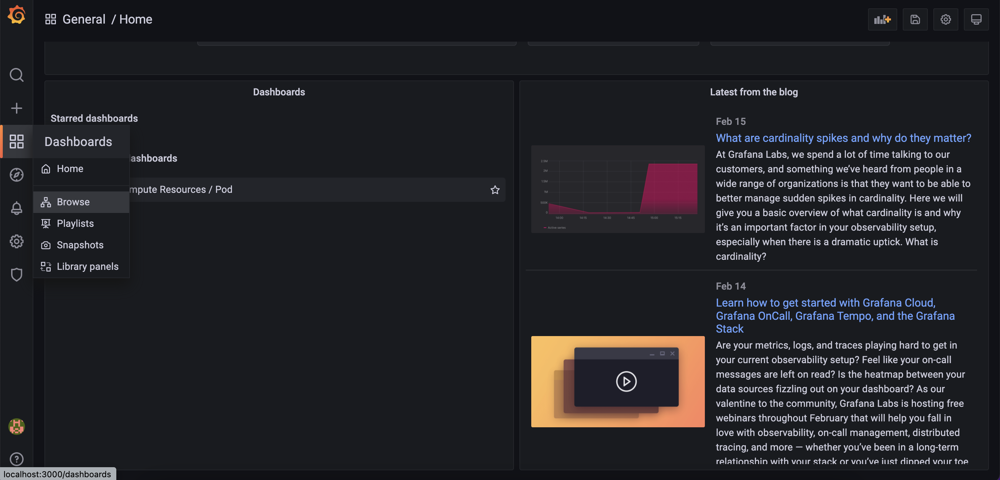
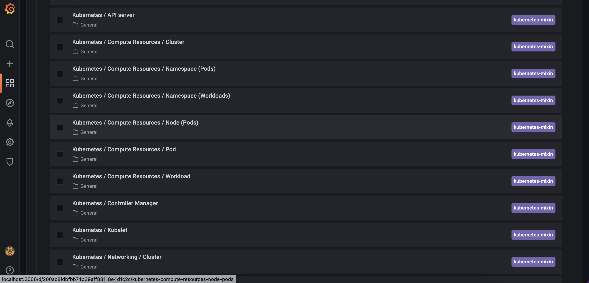
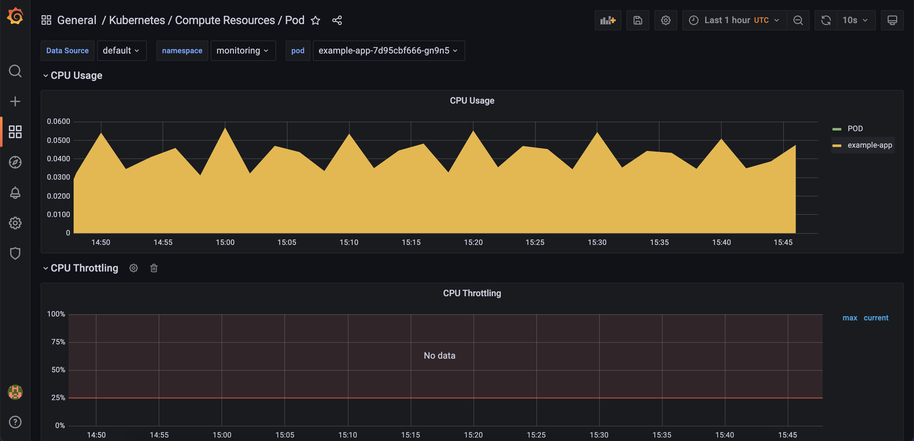

# How to Install the Prometheus Monitoring Stack
## Table of contents
- [Prerequisites](#prerequisites)
- [Step 1 - Installing the Prometheus Stack](#step-1---installing-the-prometheus-stack)
## Prerequisites
1. A [Git](https://git-scm.com/downloads) client, to clone the `Starter Kit` repository.
2. [Helm](https://www.helms.sh), for managing `Promtheus` stack releases and upgrades.
3. [Kubectl](https://kubernetes.io/docs/tasks/tools), for `Kubernetes` interaction.
4. [Curl](https://curl.se/download.html), for testing the examples (backend applications).

## Step 1 - Installing the Prometheus Stack
1. Clone project
    ```shell
    git clone https://github.com/kittisuw/kube-prometheus-stack.git
    cd kube-prometheus-stack
    ```
2. เพิ่ม helm repository prometheus-community และ list chart ที่มีให้ใช้ 
    ```shell
    helm repo add prometheus-community https://prometheus-community.github.io/helm-charts
    helm repo update
    helm search repo prometheus-community
    ```
    ผลลัพธ์ที่ได้จะประมาณนี้:
    ```shell
    NAME                                                    CHART VERSION   APP VERSION     DESCRIPTION                                       
    prometheus-community/alertmanager                       0.15.0          v0.23.0         The Alertmanager handles alerts sent by client ...
    prometheus-community/kube-prometheus-stack              32.2.1          0.54.0          kube-prometheus-stack collects Kubernetes manif...
    ...
    ```
3. install kube-prometheus-stack โดยใช้ Helm:
    ```shell
    HELM_CHART_VERSION="30.0.1"

    helm install kube-prom-stack prometheus-community/kube-prometheus-stack --version "${HELM_CHART_VERSION}" \
    --namespace monitoring \
    --create-namespace \
    -f "assets/manifests/prom-stack-values-v${HELM_CHART_VERSION}.yaml"
    ```
    **Note:**
    `ระบุ` version ของ `Helm` chart ที่จะใช้ในที่นี้เราจะเลือก 30.0.1

ตรวจสอบ `Prometheus` stack โดยใช้ `Helm` release status:
```shell
helm ls -n monitoring
```
ผลลัพท์จะประมาณนี้ (ข้อสังเกตุ colum STATUS ควรจะเป็น deployed):
```shell
NAME            NAMESPACE       REVISION        UPDATED                                 STATUS          CHART                           APP VERSION
kube-prom-stack monitoring      1               2022-02-16 01:09:18.394845 +0700 +07    deployed        kube-prometheus-stack-30.0.1    0.53.1
```
ตรวจสอบ `Kubernetes` resorce สำหรับ `Prometheus`:
```shell
kubectl get all -n monitoring
```
ควรจะเห็น resorce ที่ deploy แล้ว: `prometheus-node-exporter`, `kube-prome-operator`, `kube-prome-alertmanager`, `kube-prom-stack-grafana` และ `kube-state-metrics`. ผลลัพธ์จะประมาณนี้:
```shell
NAME                                                         READY   STATUS    RESTARTS   AGE
pod/alertmanager-kube-prom-stack-kube-prome-alertmanager-0   2/2     Running   0          7m13s
pod/kube-prom-stack-grafana-7745694d9b-6fgnn                 3/3     Running   0          7m28s
pod/kube-prom-stack-kube-prome-operator-5c6cb698-xfs82       1/1     Running   0          7m28s
pod/kube-prom-stack-kube-state-metrics-7b655d9967-h6vvh      1/1     Running   0          7m28s
pod/kube-prom-stack-prometheus-node-exporter-g89n5           1/1     Running   0          7m29s
pod/kube-prom-stack-prometheus-node-exporter-n2fwf           1/1     Running   0          7m29s
pod/prometheus-kube-prom-stack-kube-prome-prometheus-0       2/2     Running   0          7m13s

NAME                                               TYPE        CLUSTER-IP       EXTERNAL-IP   PORT(S)                      AGE
service/alertmanager-operated                      ClusterIP   None             <none>        9093/TCP,9094/TCP,9094/UDP   7m13s
service/kube-prom-stack-grafana                    ClusterIP   10.247.126.88    <none>        80/TCP                       7m29s
service/kube-prom-stack-kube-prome-alertmanager    ClusterIP   10.247.31.193    <none>        9093/TCP                     7m29s
service/kube-prom-stack-kube-prome-operator        ClusterIP   10.247.184.48    <none>        443/TCP                      7m29s
service/kube-prom-stack-kube-prome-prometheus      ClusterIP   10.247.25.74     <none>        9090/TCP                     7m29s
service/kube-prom-stack-kube-state-metrics         ClusterIP   10.247.227.107   <none>        8080/TCP                     7m29s
service/kube-prom-stack-prometheus-node-exporter   ClusterIP   10.247.127.107   <none>        9100/TCP                     7m29s
service/prometheus-operated                        ClusterIP   None             <none>        9090/TCP                     7m13s

NAME                                                      DESIRED   CURRENT   READY   UP-TO-DATE   AVAILABLE   NODE SELECTOR   AGE
daemonset.apps/kube-prom-stack-prometheus-node-exporter   2         2         2       2            2           <none>          7m29s

NAME                                                  READY   UP-TO-DATE   AVAILABLE   AGE
deployment.apps/kube-prom-stack-grafana               1/1     1            1           7m29s
deployment.apps/kube-prom-stack-kube-prome-operator   1/1     1            1           7m29s
deployment.apps/kube-prom-stack-kube-state-metrics    1/1     1            1           7m29s

NAME                                                            DESIRED   CURRENT   READY   AGE
replicaset.apps/kube-prom-stack-grafana-7745694d9b              1         1         1       7m28s
replicaset.apps/kube-prom-stack-kube-prome-operator-5c6cb698    1         1         1       7m28s
replicaset.apps/kube-prom-stack-kube-state-metrics-7b655d9967   1         1         1       7m28s

NAME                                                                    READY   AGE
statefulset.apps/alertmanager-kube-prom-stack-kube-prome-alertmanager   1/1     7m13s
statefulset.apps/prometheus-kube-prom-stack-kube-prome-prometheus       1/1     7m13s
```
ถึงขั้นตอนนี้ก็จะสามารถใช้งาน `Grafana` (ใช้ default user/pwd:`admin/prom-operator` ซึ่งอยู่ใน config [prom-stack-values-v30.0.1](assets/manifests/prom-stack-values-v30.0.1.yaml#L17) file), ได้โดยใช้ port forwarding ไปหา local machine:
```shell
kubectl --namespace monitoring port-forward svc/kube-prom-stack-grafana 3000:80
```
Important Note:
**ไม่ควร** expose Gragana ออก `public` network (ควรจะใช้ ingress mapping หรือ Loadbalance service), สามารถเลือก `Dashboard -> Manage` ในนั้นจะมี dashboard ต่างๆ ให้เลือก
## Step 2 - Running application for test
หลังจากที deploy   `Prometheus` และ `Grafana` ลง Kubernetes cluster เรียบร้อยแล้ว, Step นี้เราจะลองสร้าง deployment,service ชือ `example-app` เพื่อมาทดสอบว่าสามารถ monitor service ได้หรือไม่
```bash
vi assets/manifests/app-test.yaml
...
apiVersion: apps/v1
kind: Deployment
metadata:
  name: example-app
  namespace: monitoring
spec:
  replicas: 3
  selector:
    matchLabels:
      app: example-app
  template:
    metadata:
      labels:
        app: example-app
    spec:
      containers:
      - name: example-app
        image: fabxc/instrumented_app
        ports:
        - name: web
          containerPort: 8080
---
kind: Service
apiVersion: v1
metadata:
  name: example-app
  namespace: monitoring
  labels:
    app: example-app
spec:
  selector:
    app: example-app
  ports:
  - name: web
    port: 8080
```
```
kubectl apply -f assets/manifests/app-test.yaml
```
## Step 3 - Visualizing Metrics Using Grafana
1. ทำ port-forward เพื่อทดสอบ
    ```shell
    kubectl --namespace monitoring port-forward svc/kube-prom-stack-grafana 3000:80
    ```

2. เลือก dashboard ในมุมมองที่ต้องการ monitor ในที่นี้เราจะเลือกดู​ pod มีการใช้งาน CPU,Memory เท่าไหร่


   

3. เลือก namespace, pod ที่ต้องการ monitor ในที่นี้เราจะเลือก application ที่เราสร้างจากจาก Step 2   
   


## Step 4 - Configuring Persistent Storage for Prometheus   
ถึง Step นี้ เราจะมา enable persistent storage สำหรับ Prometheus เพื่อป้องกันข้อมูล metric หายเวลา `service restarts` หรือเกิดเหตุ `cluster failures` ในที่นี้เเราจะขอ Disk มาใช้(Persisten Vulume Claim (PVC)) 5 Gi โดยใช้วิธีระบุ Storage Class(SC) ที่มีให้ใช้
1. List Storage Class(SC) ที่ Storage admininstrator มีให้ใช้
```shell
kubectl get storageclass

NAME                PROVISIONER                     RECLAIMPOLICY   VOLUMEBINDINGMODE      ALLOWVOLUMEEXPANSION   AGE
csi-disk            everest-csi-provisioner         Delete          Immediate              true                   15d
csi-disk-topology   everest-csi-provisioner         Delete          WaitForFirstConsumer   true                   15d
csi-nas             everest-csi-provisioner         Delete          Immediate              true                   15d
csi-obs             everest-csi-provisioner         Delete          Immediate              false                  15d
csi-sfsturbo        everest-csi-provisioner         Delete          Immediate              true                   15d
efs-performance     flexvolume-huawei.com/fuxiefs   Delete          Immediate              true                   15d
efs-standard        flexvolume-huawei.com/fuxiefs   Delete          Immediate              true                   15d
nfs-rw              flexvolume-huawei.com/fuxinfs   Delete          Immediate              true                   15d
obs-standard        flexvolume-huawei.com/fuxiobs   Delete          Immediate              false                  15d
obs-standard-ia     flexvolume-huawei.com/fuxiobs   Delete          Immediate              false                  15d
sas                 flexvolume-huawei.com/fuxivol   Delete          Immediate              true                   15d
sata                flexvolume-huawei.com/fuxivol   Delete          Immediate              true                   15d
ssd                 flexvolume-huawei.com/fuxivol   Delete          Immediate              true                   15d
```
unbar config assets/manifests/prom-stack-values-v30.0.1.yaml ดังด้านล่างในที่นี้เราจะใช้ Storage Class(SC) ที่ชื่อว่า csi-disk
```shell
...
  prometheusSpec:
    storageSpec:
      volumeClaimTemplate:
        spec:
          storageClassName: csi-disk
          accessModes: ["ReadWriteOnce"]
          resources:
            requests:
              storage: 5Gi
```
Update config โดยใช้ Helm:
```shell
HELM_CHART_VERSION="30.0.1"

helm upgrade kube-prom-stack prometheus-community/kube-prometheus-stack --version "${HELM_CHART_VERSION}" \
  --namespace monitoring \
  -f "assets/manifests/prom-stack-values-v${HELM_CHART_VERSION}.yaml"
```
## Step 5 - Configuring Persistent Storage for Grafana